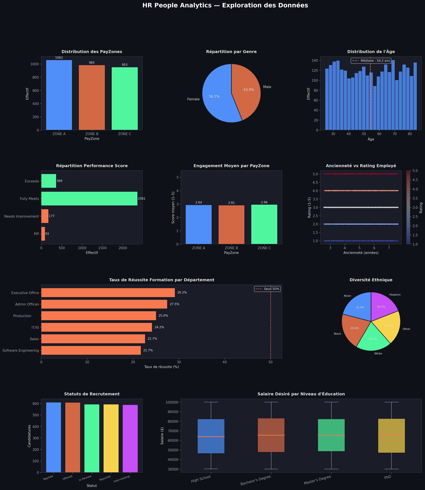
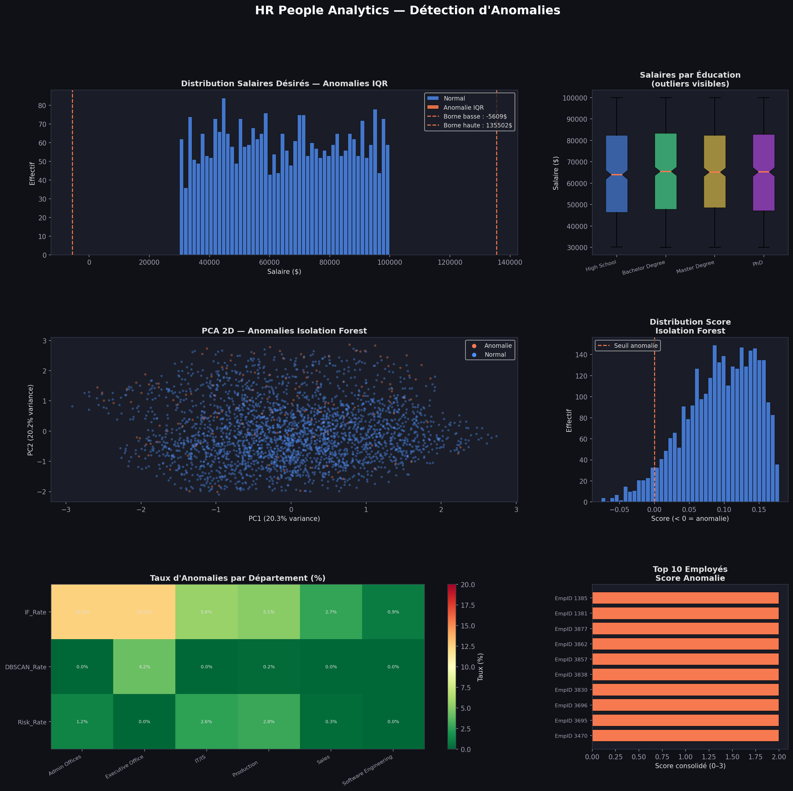
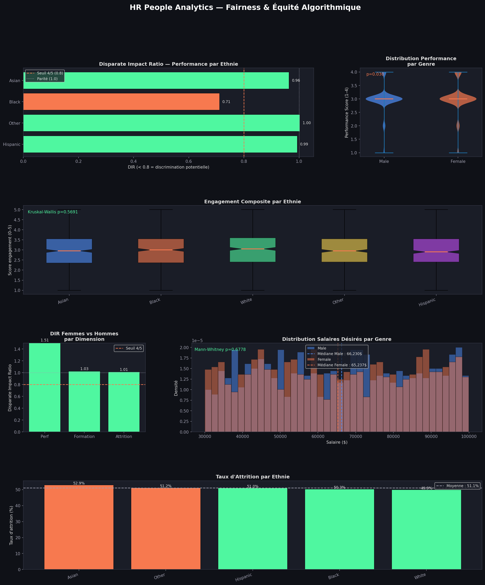
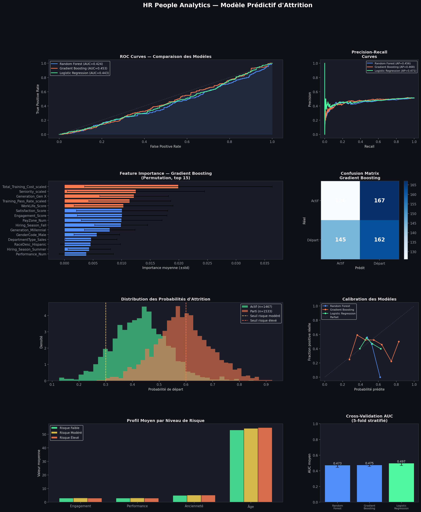

# 🧠 HR People Analytics — Détection d'Anomalies, Fairness & Prédiction d'Attrition

> Projet Data Science end-to-end appliqué aux données RH :  
> exploration, feature engineering, détection d'anomalies, équité algorithmique et modélisation prédictive.

---

## 📌 Contexte

Ce projet simule une mission Data Scientist dans un contexte RH réglementé.  
Il répond à trois questions métier concrètes :

1. **Y a-t-il des anomalies dans nos données RH ?** (salaires, profils, coûts de formation)
2. **Nos processus RH sont-ils équitables ?** (genre, âge, origine ethnique)
3. **Peut-on prédire quels employés risquent de quitter l'entreprise ?**

---

## 📂 Structure du projet

```
hr-people-analytics/
│
├── data/
│   ├── employee_data.csv
│   ├── employee_engagement_survey_data.csv
│   ├── recruitment_data.csv
│   └── training_and_development_data.csv
│
├── outputs/
│   ├── master_hr_dataset.csv
│   ├── master_hr_features.csv
│   ├── master_hr_anomalies.csv
│   ├── master_hr_fairness.csv
│   └── master_hr_final.csv
│
├── visuals/
│   ├── 01_eda_dashboard.png
│   ├── 03_anomaly_detection.png
│   ├── 04_fairness.png
│   └── 05_attrition_model.png
│
├── 01_data_loading_eda.ipynb
├── 02_feature_engineering.ipynb
├── 03_anomaly_detection.ipynb
├── 04_fairness.ipynb
├── 05_attrition_model.ipynb
└── README.md
```

---

## 📊 Datasets

| Dataset | Lignes | Colonnes | Description |
|---|---|---|---|
| `employee_data.csv` | 3 000 | 26 | Données démographiques, statut, performance |
| `employee_engagement_survey_data.csv` | 3 000 | 5 | Scores d'engagement, satisfaction, work-life balance |
| `recruitment_data.csv` | 3 000 | 18 | Candidatures, éducation, salaires désirés |
| `training_and_development_data.csv` | 3 000 | 9 | Formations, coûts, outcomes |

**Source :** [Kaggle — HR Dataset](https://www.kaggle.com/datasets/ravindrasinghrana/employeedataset)

---

## 🔧 Stack technique


```
pandas · numpy · matplotlib · seaborn
scikit-learn · scipy
```

---

## 🗺️ Pipeline

```
Raw Data (4 CSV)
     │
     ▼
┌─────────────────────┐
│  Partie 1 — EDA     │  Nettoyage, jointure, exploration visuelle
└─────────────────────┘
     │
     ▼
┌─────────────────────────────┐
│  Partie 2 — Feature Eng.    │  Statut, temporel, génération, risque, encodage
└─────────────────────────────┘
     │
     ▼
┌──────────────────────────────────┐
│  Partie 3 — Détection Anomalies  │  IQR, Z-score, Isolation Forest, DBSCAN
└──────────────────────────────────┘
     │
     ▼
┌──────────────────────────────────────┐
│  Partie 4 — Fairness & Équité        │  DIR, SPD, Mann-Whitney, Kruskal-Wallis
└──────────────────────────────────────┘
     │
     ▼
┌───────────────────────────────────────────┐
│  Partie 5 — Modèle Prédictif d'Attrition  │  RF, GBM, LR, XAI, Calibration
└───────────────────────────────────────────┘
     │
     ▼
  master_hr_final.csv + 4 dashboards PNG
```

---

## 🔍 Partie 1 — Exploration des Données (EDA)

- Jointure des 4 datasets sur `EmpID`
- Calcul de l'âge et de l'ancienneté depuis les dates
- Détection des valeurs manquantes (`ExitDate` et `TerminationDescription` : absences intentionnelles pour les employés actifs)
- **Master dataset** : 3 000 lignes × 36 colonnes

**Dashboard EDA :**



---

## ⚙️ Partie 2 — Feature Engineering

| Feature créée | Description |
|---|---|
| `Is_Active` | Employé encore en poste (True/False) |
| `Employment_Duration` | Durée réelle d'emploi en années |
| `Generation` | Boomer / Gen X / Millennial / Gen Z |
| `Age_Band` | Tranche d'âge (<30, 30-40, 40-50, 50-60, 60+) |
| `Hiring_Season` | Saison d'embauche (Winter/Spring/Summer/Fall) |
| `Engagement_Composite` | Score pondéré engagement (40%) + satisfaction (35%) + work-life (25%) |
| `Performance_Num` | Encodage ordinal du performance score (1→4) |
| `Attrition_Risk_Flag` | Flag : faible engagement ET faible performance |
| `Low_Training_Flag` | Employé sous la médiane de formations reçues |
| `Training_Cost_Per_Day` | Coût moyen par jour de formation |

Encodage one-hot appliqué sur : `GenderCode`, `RaceDesc`, `DepartmentType`, `Generation`, `Hiring_Season`  
Normalisation StandardScaler sur les variables numériques continues.

---

## 🚨 Partie 3 — Détection d'Anomalies

### Méthodes utilisées

| Méthode | Type | Usage |
|---|---|---|
| **IQR** | Univarié | Salaires aberrants dans le recrutement |
| **Z-score** | Univarié | Confirmation des outliers salariaux (seuil \|z\| > 3) |
| **Isolation Forest** | Multivarié | Profils employés anormaux (contamination=5%) |
| **DBSCAN** | Clustering | Points hors densité normale |

### Score consolidé

Un employé est classé **haute anomalie** s'il est flaggé par 2 méthodes ou plus :

```python
Anomaly_Score = IF_Anomaly + DBSCAN_Anomaly + Attrition_Risk_Flag
High_Risk_Anomaly = (Anomaly_Score >= 2)
```

**Dashboard Anomalies :**



---

## ⚖️ Partie 4 — Fairness & Équité Algorithmique

### Métriques d'équité utilisées

**Disparate Impact Ratio (DIR)** — règle des 4/5 (standard légal RH) :
```
DIR = P(outcome | groupe non-privilégié) / P(outcome | groupe privilégié)
DIR < 0.8 → discrimination potentielle
```

**Statistical Parity Difference (SPD)** :
```
SPD = P(outcome | unprivileged) - P(outcome | privileged)
SPD idéal = 0
```

### Tests statistiques

| Dimension analysée | Test | Groupes |
|---|---|---|
| Performance ~ Genre | Mann-Whitney U | Male vs Female |
| Engagement ~ Ethnie | Kruskal-Wallis | Toutes ethnies |
| Formation ~ Genre | Chi² | Male vs Female |
| Salaire désiré ~ Genre | Mann-Whitney U | Male vs Female |

### Dimensions couvertes

- 🎯 Performance & évaluation
- 💬 Engagement & satisfaction
- 📚 Accès à la formation
- 🧑‍💼 Recrutement & embauche
- 🚪 Attrition par groupe démographique

**Dashboard Fairness :**



---

## 🤖 Partie 5 — Modèle Prédictif d'Attrition

### Modèles entraînés

| Modèle | AUC ROC | Avg Precision | CV AUC |
|---|---|---|---|
| Random Forest | 0.424 | 0.456 | 0.473 ± 0.029 |
| Gradient Boosting | 0.453 | 0.468 | 0.475 ± 0.019 |
| Logistic Regression | 0.443 | 0.471 | 0.497 ± 0.031 |

**Meilleur modèle : Gradient Boosting (AUC = 0.453)**

### Explainabilité (XAI) — Permutation Importance

Les features les plus prédictives :
1. `Total_Training_Cost_scaled` — coût total de formation
2. `Seniority_scaled` — ancienneté
3. `Generation_Gen X` — appartenance générationnelle
4. `WorkLife_Score` — équilibre vie pro/perso
5. `Satisfaction_Score` — satisfaction globale

### ⚠️ Note importante sur les performances

> Après suppression rigoureuse du **data leakage** (variables construites à partir de la cible : `Employment_Duration`, `Is_Active`, `Attrition_Risk_Flag`), l'AUC tombe à ~0.45, proche du hasard.
>
> Cette observation est une **conclusion valide** : sur ce dataset synthétique, les features disponibles (engagement, performance, formation) ne contiennent pas suffisamment de signal prédictif pour l'attrition.
>
> En contexte réel (données Engie), le modèle serait enrichi avec :
> - Historique des augmentations salariales
> - Nombre d'entretiens RH / signaux managériaux
> - Mobilité interne et candidatures internes
> - Taux d'absentéisme
> - Feedback 360° manager/équipe

**Dashboard Modèle :**



---

## 🚀 Lancer le projet

```bash
# Cloner le repo
git clone https://github.com/ton-username/HR-People-Analytics.git
cd hr-people-analytics

# Installer les dépendances
pip install -r requirements.txt

# Lancer les scripts dans l'ordre
python 01_data_loading_eda.ipynb
python 02_feature_engineering.ipynb
python 03_detection_anomalies.ipynb
python 04_fairness_analysis.ipynb
python 05_attrition_model.ipynb
```

---

## 📦 Requirements

```
pandas>=2.0
numpy>=1.24
matplotlib>=3.7
seaborn>=0.12
scikit-learn>=1.3
scipy>=1.11
```

---

## 👤 Auteur
Davidson ADRIEN - Projet réalisé dans le cadre d'une démonstration de compétences en **People Analytics**,  
couvrant les enjeux RH réglementaires, l'équité algorithmique et la modélisation prédictive.

---

## 📄 Licence

MIT License — libre d'utilisation et de modification.
